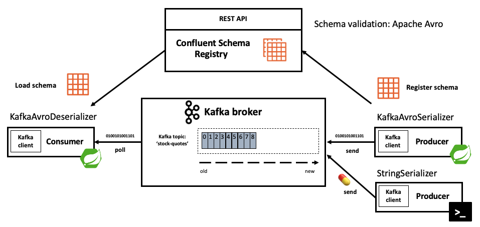

# Spring I/O Barcelona 2022 - Spring Kafka beyond the basics

Codebase for [my talk on Spring I/O 2022](https://2022.springio.net/sessions/spring-kafka-beyond-the-basics-lessons-learned-on-our-kafka-journey-at-ing-bank) in Barcelona about Spring for Apache Kafka

[Slides](https://speakerdeck.com/timvanbaarsen/spring-kafka-beyond-the-basics-lessons-learned-on-our-kafka-journey-at-ing-bank)

## Project modules and applications

| Applications                   | Port | Avro  | Topic(s)      | Description                                                              |
|--------------------------------|------|-------|---------------|--------------------------------------------------------------------------|
| spring-kafka-producer          | 8080 | YES   | stock-quotes  | Simple producer of random stock quotes using Spring Kafka & Apache Avro. |
| spring-kafka-consumer          | 8082 | YES   | stock-quotes  | Simple consumer of stock quotes using using Spring Kafka & Apache Avro.  |
| stock-quote-kafka-streams-avro | 8083 | YES   | stock-quotes  | Simple Kafka Streams application using Spring Kafka & Apache Avro.       |

| Module     | Description                                                                                                                                                                                             |
|------------|---------------------------------------------------------------------------------------------------------------------------------------------------------------------------------------------------------|
| avro-model | Holds the Avro schema for the Stock Quote including `avro-maven-plugin` to generate Java code based on the Avro Schema. This module is used by both the producer, consumer and Kafka streams application. |

Note Confluent Schema Registry is running on port: `8081` using Docker see: [docker-compose.yml](docker-compose.yml).




## Version

* Confluent Kafka 7.1.x
* Confluent Schema Registry 7.1.x
* Java 11
* Spring Boot 2.6.x
* Spring Kafka 2.8.5
* Apache Avro 1.11

## Components running in Docker

* Kafka (port 9092)
* Zookeeper (port 2181)
* [Schema Registry](http://localhost:8081)
* [Kafka UI](http://localhost:9000)
* [Zipkin](http://localhost:9411)
* [Prometheus](http://localhost:9090)
* [Grafana](http://localhost:3000/)

## Build

```
./mvnw clean package
```

## Run 

### without monitoring

```
docker-compose up -d
```

### with monitoring

```
docker-compose -f docker-compose.yml -f docker-compose-monitoring.yml up -d
```

## Poison pill scenario: Deserialization exceptions

Start the Kafka console producer from the command line

```
docker exec -it kafka bash
unset JMX_PORT
```

```
kafka-console-producer --bootstrap-server localhost:9092 --topic stock-quotes
```

The console is waiting for input. Now publish the poison pill:

```
💊
```

Result:

Kafka streams application:

* Streams thread will stop

```
2022-05-23 14:44:00.014  INFO [streams-application,,] 20635 --- [-StreamThread-1] o.a.k.s.p.internals.StreamThread         : stream-thread [streams-application-6095314e-a3d3-4027-8215-dc9270a3b341-StreamThread-1] Shutdown complete
Exception in thread "streams-application-6095314e-a3d3-4027-8215-dc9270a3b341-StreamThread-1" org.apache.kafka.streams.errors.StreamsException: Deserialization exception handler is set to fail upon a deserialization error. If you would rather have the streaming pipeline continue after a deserialization error, please set the default.deserialization.exception.handler appropriately.
	at org.apache.kafka.streams.processor.internals.RecordDeserializer.deserialize(RecordDeserializer.java:83)
	at org.apache.kafka.streams.processor.internals.RecordQueue.updateHead(RecordQueue.java:176)
	at org.apache.kafka.streams.processor.internals.RecordQueue.addRawRecords(RecordQueue.java:112)
	at org.apache.kafka.streams.processor.internals.PartitionGroup.addRawRecords(PartitionGroup.java:304)
	at org.apache.kafka.streams.processor.internals.StreamTask.addRecords(StreamTask.java:960)
	at org.apache.kafka.streams.processor.internals.TaskManager.addRecordsToTasks(TaskManager.java:1000)
	at org.apache.kafka.streams.processor.internals.StreamThread.pollPhase(StreamThread.java:914)
	at org.apache.kafka.streams.processor.internals.StreamThread.runOnce(StreamThread.java:720)
	at org.apache.kafka.streams.processor.internals.StreamThread.runLoop(StreamThread.java:583)
	at org.apache.kafka.streams.processor.internals.StreamThread.run(StreamThread.java:555)
Caused by: org.apache.kafka.common.errors.SerializationException: Unknown magic byte!
	at io.confluent.kafka.serializers.AbstractKafkaSchemaSerDe.getByteBuffer(AbstractKafkaSchemaSerDe.java:250)
	at io.confluent.kafka.serializers.AbstractKafkaAvroDeserializer$DeserializationContext.<init>(AbstractKafkaAvroDeserializer.java:322)
	at io.confluent.kafka.serializers.AbstractKafkaAvroDeserializer.deserialize(AbstractKafkaAvroDeserializer.java:112)
	at io.confluent.kafka.serializers.KafkaAvroDeserializer.deserialize(KafkaAvroDeserializer.java:55)
	at io.confluent.kafka.streams.serdes.avro.SpecificAvroDeserializer.deserialize(SpecificAvroDeserializer.java:66)
	at io.confluent.kafka.streams.serdes.avro.SpecificAvroDeserializer.deserialize(SpecificAvroDeserializer.java:38)
	at org.apache.kafka.common.serialization.Deserializer.deserialize(Deserializer.java:60)
	at org.apache.kafka.streams.processor.internals.SourceNode.deserializeValue(SourceNode.java:58)
	at org.apache.kafka.streams.processor.internals.RecordDeserializer.deserialize(RecordDeserializer.java:66)
	... 9 more
```

Consumer application:

* Will end up in an infinite loop of Deserialization exceptions

```
2022-05-23 14:44:22.864 ERROR [consumer-application,,] 20179 --- [eListener-0-C-1] o.s.k.l.KafkaMessageListenerContainer    : Consumer exception

java.lang.IllegalStateException: This error handler cannot process 'SerializationException's directly; please consider configuring an 'ErrorHandlingDeserializer' in the value and/or key deserializer
	at org.springframework.kafka.listener.DefaultErrorHandler.handleOtherException(DefaultErrorHandler.java:149) ~[spring-kafka-2.8.5.jar:2.8.5]
	at org.springframework.kafka.listener.KafkaMessageListenerContainer$ListenerConsumer.handleConsumerException(KafkaMessageListenerContainer.java:1790) ~[spring-kafka-2.8.5.jar:2.8.5]
	at org.springframework.kafka.listener.KafkaMessageListenerContainer$ListenerConsumer.run(KafkaMessageListenerContainer.java:1297) ~[spring-kafka-2.8.5.jar:2.8.5]
	at java.base/java.util.concurrent.Executors$RunnableAdapter.call(Executors.java:515) ~[na:na]
	at java.base/java.util.concurrent.FutureTask.run(FutureTask.java:264) ~[na:na]
	at java.base/java.lang.Thread.run(Thread.java:834) ~[na:na]
Caused by: org.apache.kafka.common.errors.RecordDeserializationException: Error deserializing key/value for partition stock-quotes-0 at offset 76. If needed, please seek past the record to continue consumption.
	at org.apache.kafka.clients.consumer.internals.Fetcher.parseRecord(Fetcher.java:1429) ~[kafka-clients-3.0.1.jar:na]
	at org.apache.kafka.clients.consumer.internals.Fetcher.access$3400(Fetcher.java:134) ~[kafka-clients-3.0.1.jar:na]
	at org.apache.kafka.clients.consumer.internals.Fetcher$CompletedFetch.fetchRecords(Fetcher.java:1652) ~[kafka-clients-3.0.1.jar:na]
	at org.apache.kafka.clients.consumer.internals.Fetcher$CompletedFetch.access$1800(Fetcher.java:1488) ~[kafka-clients-3.0.1.jar:na]
	at org.apache.kafka.clients.consumer.internals.Fetcher.fetchRecords(Fetcher.java:721) ~[kafka-clients-3.0.1.jar:na]
	at org.apache.kafka.clients.consumer.internals.Fetcher.fetchedRecords(Fetcher.java:672) ~[kafka-clients-3.0.1.jar:na]
	at org.apache.kafka.clients.consumer.KafkaConsumer.pollForFetches(KafkaConsumer.java:1277) ~[kafka-clients-3.0.1.jar:na]
	at org.apache.kafka.clients.consumer.KafkaConsumer.poll(KafkaConsumer.java:1238) ~[kafka-clients-3.0.1.jar:na]
	at org.apache.kafka.clients.consumer.KafkaConsumer.poll(KafkaConsumer.java:1166) ~[kafka-clients-3.0.1.jar:na]
	at jdk.internal.reflect.GeneratedMethodAccessor89.invoke(Unknown Source) ~[na:na]
	at java.base/jdk.internal.reflect.DelegatingMethodAccessorImpl.invoke(DelegatingMethodAccessorImpl.java:43) ~[na:na]
	at java.base/java.lang.reflect.Method.invoke(Method.java:566) ~[na:na]
	at org.springframework.aop.support.AopUtils.invokeJoinpointUsingReflection(AopUtils.java:344) ~[spring-aop-5.3.19.jar:5.3.19]
	at org.springframework.aop.framework.JdkDynamicAopProxy.invoke(JdkDynamicAopProxy.java:208) ~[spring-aop-5.3.19.jar:5.3.19]
	at com.sun.proxy.$Proxy138.poll(Unknown Source) ~[na:na]
	at brave.kafka.clients.TracingConsumer.poll(TracingConsumer.java:89) ~[brave-instrumentation-kafka-clients-5.13.7.jar:na]
	at brave.kafka.clients.TracingConsumer.poll(TracingConsumer.java:83) ~[brave-instrumentation-kafka-clients-5.13.7.jar:na]
	at org.springframework.kafka.listener.KafkaMessageListenerContainer$ListenerConsumer.pollConsumer(KafkaMessageListenerContainer.java:1521) ~[spring-kafka-2.8.5.jar:2.8.5]
	at org.springframework.kafka.listener.KafkaMessageListenerContainer$ListenerConsumer.doPoll(KafkaMessageListenerContainer.java:1511) ~[spring-kafka-2.8.5.jar:2.8.5]
	at org.springframework.kafka.listener.KafkaMessageListenerContainer$ListenerConsumer.pollAndInvoke(KafkaMessageListenerContainer.java:1339) ~[spring-kafka-2.8.5.jar:2.8.5]
	at org.springframework.kafka.listener.KafkaMessageListenerContainer$ListenerConsumer.run(KafkaMessageListenerContainer.java:1251) ~[spring-kafka-2.8.5.jar:2.8.5]
	... 3 common frames omitted
Caused by: org.apache.kafka.common.errors.SerializationException: Unknown magic byte!
	at io.confluent.kafka.serializers.AbstractKafkaSchemaSerDe.getByteBuffer(AbstractKafkaSchemaSerDe.java:250) ~[kafka-schema-serializer-7.1.0.jar:na]
	at io.confluent.kafka.serializers.AbstractKafkaAvroDeserializer$DeserializationContext.<init>(AbstractKafkaAvroDeserializer.java:322) ~[kafka-avro-serializer-7.1.0.jar:na]
	at io.confluent.kafka.serializers.AbstractKafkaAvroDeserializer.deserialize(AbstractKafkaAvroDeserializer.java:112) ~[kafka-avro-serializer-7.1.0.jar:na]
	at io.confluent.kafka.serializers.KafkaAvroDeserializer.deserialize(KafkaAvroDeserializer.java:55) ~[kafka-avro-serializer-7.1.0.jar:na]
	at org.apache.kafka.common.serialization.Deserializer.deserialize(Deserializer.java:60) ~[kafka-clients-3.0.1.jar:na]
	at org.apache.kafka.clients.consumer.internals.Fetcher.parseRecord(Fetcher.java:1420) ~[kafka-clients-3.0.1.jar:na]
	... 23 common frames omitted
```

Magic byte?

The first byte of the message is a magic byte marker.
This as an Avro serialized message.
Without the magic byte marker the KafkaAvroDeserializer will refuse to read the message!
Since we published a message without Avro using the console consumer we don't have a magic byte.

After configuring the dead letter topic recoverer you should see something in you log file like: 

```
2022-05-23 15:49:51.969 DEBUG [consumer-application,14f637ce05adcec2,5263c9f7713ba810] 50590 --- [ad | producer-1] o.s.k.l.DeadLetterPublishingRecoverer    : Successful dead-letter publication: stock-quotes-1@2270 to stock-quotes.DLT-1@0
```

## Exception handling in consumer

Publish a record to Kafka to trigger an exception in the StockQuoteConsumer see: ShakyStockQuoteService.

```
curl -v -X POST http://localhost:8080/api/quotes -H 'Content-Type: application/json' -d '{ "symbol": "KABOOM", "exchange": "AMS", "tradeValue": "101.99", "currency": "EUR", "description": "Trigger exception!" }'
```

Or using IntelliJ http client [rest-api-requests.http](http-calls/rest-api-requests.http)

## More advances configuration

### Error handling based on exception type

In case you want to send messages to handle exception in a different way take a look at Spring Kafka's: CommonDelegatingErrorHandler.

See Spring Kafka [documentation](https://docs.spring.io/spring-kafka/docs/current/reference/html/#cond-eh)

### Publish to different deadletter topic based on exception type

In case you want to send messages to different dead letter topics based on the exception take a look at custom destination resolvers:

```
private static final BiFunction<ConsumerRecord<?, ?>, Exception, TopicPartition> CUSTOM_DESTINATION_RESOLVER = (record, exception) -> {

    if (exception.getCause() != null && exception.getCause() instanceof DeserializationException) {
        return new TopicPartition(record.topic() + ".deserialization.failures", record.partition());
    }

    if (exception.getCause() instanceof MethodArgumentNotValidException) {
        return new TopicPartition(record.topic() + ".validation.failures", record.partition());
    }

    else {
        return new TopicPartition(record.topic() + ".other.failures", record.partition());
    }
};

@Bean
public DeadLetterPublishingRecoverer recoverer(KafkaTemplate<?, ?> bytesKafkaTemplate, KafkaTemplate<?, ?> kafkaTemplate) {
    Map<Class<?>, KafkaOperations<? extends Object, ? extends Object>> templates = new LinkedHashMap<>();
    templates.put(byte[].class, bytesKafkaTemplate);
    templates.put(StockQuote.class, kafkaTemplate);
    return new DeadLetterPublishingRecoverer(templates, CUSTOM_DESTINATION_RESOLVER);
}
```

## Shutdown 

```
docker-compose down -v
```

```
docker-compose -f docker-compose.yml -f docker-compose-monitoring.yml down -v
```
